<!--
substrate-idl.md — real `problem-decomposer` run on the substrate-IDL
aspiration. NOT the illustrative example in
`skills/problem-decomposer/examples/substrate-idl.md` — that file stays
as the hand-drafted reference. This doc is grounded in verified file
paths under ~/remotes/art/ and ~/github/art/ as of decomposition date.

Drafted by claude-opus-4-7 on 2026-05-18.
-->

# Problem decomposition — `substrate-idl`

> **Decomposed:** 2026-05-18 by `problem-decomposer`
> **Status:** Draft
> **Refresh after:** 2026-08-18 (≤ 3 months — aspirations age)

## Aspiration

We ship a **platform**, not a collection of repos: a coherent substrate where capabilities (credential-isolation, interlace-lease, workload-identity, …) are described once in a vendor-neutral IDL, compiled to every consumer language we ship, version-coordinated through a single release manifest, attested end-to-end, and adopted by external consumers in <1 day per capability. The 8+ repos in the art ecosystem retain their identities (URLs, stars, install paths) but the *substrate they share* is one navigable, agent-readable document tree.

The three-layer identity stack is in scope as a first-class participant: **signet** (auth — "do you have the key?"), **sigid** (context — "who are you, how did you get here?"), and **cloister/interlace** (authz — "what can you do?") each ship in their own repo but speak one substrate vocabulary.

## 5-Whys descent

### Chain 1 — declarative substrate IDL with canonical traits

```
[ASPIRATION]   ship a platform, not a collection of repos
   ↑ why?
[REQUIREMENT R1] cross-repo coherence needs a shared, machine-readable substrate description
   ↑ why?
[REQUIREMENT R2] capnp + annotations is our IDL of record; needs canonical traits + diff tooling
   ↑ why?
[REQUIREMENT R3] schema-bridge is single-target (zod), no plugin shape, no breaking-change detection, no const support
   ↑ why?
[DISPATCHABLE L1] add top-level `const` support to schema-bridge
[DISPATCHABLE L2] declare canonical traits in `cloister-spec/_traits.capnp`
[DISPATCHABLE L3] add `schema-bridge diff <old> <new>` subcommand
```

### Chain 2 — release-coordination manifest (art.lock + channels)

```
[ASPIRATION]   ship a platform, not a collection of repos
   ↑ why?
[REQUIREMENT R4] consumers need to know which (cloister, notme, signet, sigid, mache, ley-line, schema-bridge) versions work together
   ↑ why?
[REQUIREMENT R5] there must be a queryable, content-addressed "art-YYYY.MM.X = these pins" manifest
   ↑ why?
[REQUIREMENT R6] the manifest must itself be a substrate-IDL artifact (dogfood capnp + canonical traits)
   ↑ why?
[DISPATCHABLE L4] write ADR-0022 in cloister formalizing schema-bridge positioning + substrate-IDL framing (hole-filler)
[DISPATCHABLE L5] spec `art.lock` capnp schema in `cloister/cloister-spec/substrate-manifest/v0/`
```

### Chain 3 — capability spec discipline (vendor-neutral, 2nd-impl-conformable)

```
[ASPIRATION]   ship a platform, not a collection of repos
   ↑ why?
[REQUIREMENT R7] each capability needs a vendor-neutral spec a 2nd impl could conform to
   ↑ why?
[REQUIREMENT R8] specs need a fixed directory shape (consumers find them; agents parse them)
   ↑ why?
[DISPATCHABLE L6] formalize the spec directory layout doc (`cloister/cloister-spec/LAYOUT.md`) using interlace-spec/0.1.0/ + credential-isolation/v1/ as the template
[DISPATCHABLE L7] write conformance test vectors for credential-isolation/v1 (currently has wire/ but no test-vectors/)
```

### Chain 4 — supply-chain attestation (signet → cosign → Rekor)

```
[ASPIRATION]   ship a platform, not a collection of repos
   ↑ why?
[REQUIREMENT R9] external consumers must be able to trust what they install (no unsigned tarballs)
   ↑ why?
[REQUIREMENT R10] every released manifest + capability bundle must be signed by an attestable identity
   ↑ why?
[REQUIREMENT R11] signet primitives (sigstore-kms-signet, GHA OIDC bridge) exist but aren't wired into any release workflow
   ↑ why?
[DISPATCHABLE L8] flip `--tlog-upload=true` in signet's documented cosign example + add Rekor verification docs
[DISPATCHABLE L9] add `release.yml` GHA workflow in cloister: build artifact → `cosign sign-blob --key signet://gha-bridge` → upload to Rekor
[NON-LEAF NL1] SLSA L1 provenance predicate emitter (needs L8/L9 first + a SLSA-target ADR)
```

### Chain 5 — identity-stack vocabulary alignment (SPIFFE + macaroons legibility)

```
[ASPIRATION]   ship a platform, not a collection of repos
   ↑ why?
[REQUIREMENT R12] outside consumers must be able to map our identity stack onto CNCF / academic vocabulary
   ↑ why?
[REQUIREMENT R13] signet's CA-rotation + ephemeral certs are SPIRE-shaped but use different names (epoch ↔ spiffe_sequence, bridge-cert ↔ SVID)
   ↑ why?
[REQUIREMENT R14] without vocabulary alignment, every external reader pays a translation tax forever
   ↑ why?
[DISPATCHABLE L10] embed `URI:spiffe://<trust-domain>/<workload>` SAN in signet ephemeral X.509 certs (extend `pkg/attest/x509/localca.go`)
[DISPATCHABLE L11] write `signet/docs/sigstore-vocabulary-map.md` + `signet/docs/spiffe-vocabulary-map.md` (side-by-side tables — signet ↔ Fulcio, signet ↔ SPIRE)
[NON-LEAF NL2] interlace 0.2.0 third-party caveats + discharge protocol (design unfinished; ADR pending)
```

### Chain 6 — adoption ergonomics (`<1 day per capability`)

```
[ASPIRATION]   ship a platform, not a collection of repos
   ↑ why?
[REQUIREMENT R15] external teams must adopt one capability in <1 day
   ↑ why?
[REQUIREMENT R16] every published capability needs a 13-line-quickstart shape (`buf.gen.yaml`-grade ergonomics)
   ↑ why?
[REQUIREMENT R17] capability specs need a single source of truth + an executable hello-world per consumer language
   ↑ why?
[DISPATCHABLE L12] write `cloister/cloister-spec/credential-isolation/v1/QUICKSTART.md` — 1-page consumer walkthrough; verify against ref-impl-py/
[NON-LEAF NL3] generated operator recipes per (capability × consumer language) — needs consumer-profile schema first
```

## Requirement lattice

| ID  | Requirement | Parent(s) | Child(ren) |
|-----|-------------|-----------|------------|
| R1  | cross-repo coherence needs shared substrate description | Aspiration | R2 |
| R2  | capnp + canonical traits + diff tooling | R1 | R3, L2 |
| R3  | schema-bridge plugin-shape + missing constructs | R2 | L1, L3 |
| R4  | consumers need known-compatible version sets | Aspiration | R5 |
| R5  | content-addressed manifest artifact | R4 | R6 |
| R6  | manifest is substrate-IDL artifact (dogfood) | R5 | L4, L5 |
| R7  | vendor-neutral 2nd-impl-conformable spec per capability | Aspiration | R8 |
| R8  | fixed spec directory shape | R7 | L6, L7 |
| R9  | external consumers can trust installs | Aspiration | R10 |
| R10 | signed + attested release artifacts | R9 | R11 |
| R11 | wire existing signet primitives into release workflows | R10 | L8, L9, NL1 |
| R12 | identity-stack legible to CNCF / academic vocabulary | Aspiration | R13 |
| R13 | signet vocabulary aligned with SPIFFE / Sigstore | R12 | R14 |
| R14 | translation cost paid once, in docs + cert SANs | R13 | L10, L11, NL2 |
| R15 | external teams adopt one capability in <1 day | Aspiration | R16 |
| R16 | 13-line-quickstart shape per capability | R15 | R17 |
| R17 | single source of truth + executable hello-world | R16 | L12, NL3 |

**Lattice signals (multi-parent leaves):**

- **L2 (`_traits.capnp`)** serves **R2** (canonical traits for substrate IDL) AND **R8** (per-capability specs that *use* the traits) AND indirectly **R14** (a `$Capability(scheme, scope)` trait is the vocabulary alignment artifact for the authz layer). It's the single most upstream artifact in the lattice.
- **L4 (ADR-0022)** is referenced by L2, L3, L5 — it's the hole-filler that anchors the schema-bridge + substrate framing. Without it, the trait library and the manifest schema both hang on prose-only justification.
- **L5 (`art.lock` schema)** dogfoods both R2 (uses canonical traits) and R6 (is the manifest artifact); it's the first place L2's traits get *exercised* by a non-toy schema.

## Dispatchable leaves

### L1 — Add top-level `const` support to schema-bridge

- **Aspiration root:** ship a platform, not a collection of repos
- **Why chain:** L1 → R3 → R2 → R1 → Aspiration
- **Problem statement:** `cloister/tools/schema-bridge` (Rust, runs as `capnpc-schema-bridge` capnp compiler plugin) parses capnp schemas and emits zod TypeScript. It currently errors on top-level `const` declarations. Existing tests live at `tools/schema-bridge/tests/integration.rs`; codegen lives at `tools/schema-bridge/src/outputs/zod.rs`; IR module at `tools/schema-bridge/src/ir/mod.rs`. This is the gating gap before `@notme/contract` (`/Users/jamesgardner/remotes/art/notme/packages/contract/src/index.ts`) can adopt capnp-as-source-of-truth, and before `_traits.capnp` (L2) can declare named annotation values as constants.
- **Acceptance criteria:** `cargo test -p schema-bridge` passes with 3+ new tests covering scalar const, list const, struct const. New fixture file `tools/schema-bridge/tests/fixtures/with_const.capnp` exists. `tools/schema-bridge/src/ir/mod.rs` gains a `Const` IR variant. `tools/schema-bridge/src/outputs/zod.rs` emits each const as a named export with `as const` literal type. CI's existing `ci.yml` lint job stays green.
- **Inputs:**
  - `/Users/jamesgardner/remotes/art/cloister/tools/schema-bridge/src/inputs/capnp.rs` (current parser)
  - `/Users/jamesgardner/remotes/art/cloister/tools/schema-bridge/src/ir/mod.rs` (IR — needs `Const` variant)
  - `/Users/jamesgardner/remotes/art/cloister/tools/schema-bridge/src/outputs/zod.rs` (target emitter)
  - `/Users/jamesgardner/remotes/art/cloister/tools/schema-bridge/tests/integration.rs` (existing tests)
  - `/Users/jamesgardner/remotes/art/cloister/tools/schema-bridge/Cargo.toml` (crate root)
  - Cap'n Proto §const: <https://capnproto.org/language.html>
- **Expected output shape:** PR against `cloister` `main`. Touches the four source files above + adds 1 fixture file + 1 new test module. Net diff <400 lines.
- **Scope boundary:** const support in schema-bridge codegen only. `@notme/contract` migration to consume const is downstream (NL3-adjacent — re-check after L1 ships). Generics / annotations propagation are separate beads.
- **Failure mode:** `cargo test` exits non-zero; new tests show in the output.
- **Time-box estimate:** S (≤1 session)
- **Suggested target repo:** cloister
- **Suggested priority:** P2
- **Depends on:** none
- **Dispatchability score:**
  1. Self-contained ✓ (full problem in this section)
  2. Falsifiable ✓ (`cargo test -p schema-bridge` exit code + named fixture file)
  3. Enumerable inputs ✓ (5 files + capnp spec URL)
  4. Shape-predictable output ✓ (PR, <400 line diff, named touched files)
  5. Bounded scope ✓ (const only; migration explicitly excluded)
  6. Observable failure ✓ (test exit code)
  7. Realistic time-box ✓ (S)

### L2 — Declare canonical traits in `cloister-spec/_traits.capnp`

- **Aspiration root:** ship a platform, not a collection of repos
- **Why chain:** L2 → R2 → R1 → Aspiration; also L2 → R8 → R7 → Aspiration; also L2 → R14 → R13 → R12 → Aspiration *(multi-parent: the trait library is what makes specs vendor-neutral AND what carries the identity-stack vocabulary)*
- **Problem statement:** Per `docs/prior-art/smithy.md` Decision §Borrow, declare a canonical trait library at `cloister/cloister-spec/_traits.capnp` with the following annotations: `$Sensitive`, `$Scope(value :Text)`, `$WireEnvelope`, `$Op(input, output, errors)` (from Smithy operation shape), `$Capability(scheme :Text, scope :Text)` (from Smithy `@auth` pattern, vocabulary-aligned with interlace lease — see `docs/prior-art/macaroons.md` §Adopt), `$Required`, `$Deprecated(version :Text)`, `$Since(version :Text)`, `$Unstable(feature :Text)` (last three from `docs/prior-art/wit.md` Decision §Borrow). Document semantics in a sibling `cloister-spec/_traits.md`. Exercise the library by updating `interlace-spec/0.1.0/wire/proxy-envelope.md`'s associated capnp file (if one exists; otherwise the credential-isolation/v1/wire/lease-envelope.md capnp) to use ≥2 traits.
- **Acceptance criteria:** Files exist: `cloister/cloister-spec/_traits.capnp` (9 annotation declarations), `cloister/cloister-spec/_traits.md` (one paragraph per annotation). `capnpc-schema-bridge` (the schema-bridge binary) parses the trait file without errors (`cargo run -p schema-bridge -- cloister-spec/_traits.capnp` exits 0). At least 1 existing capnp file under `cloister/cloister-spec/credential-isolation/v1/wire/` references ≥2 traits.
- **Inputs:**
  - `/Users/jamesgardner/remotes/art/cloister/cloister-spec/` (current spec dir)
  - `/Users/jamesgardner/remotes/art/cloister/cloister-spec/credential-isolation/v1/wire/lease-envelope.md` (demonstrator target)
  - `/Users/jamesgardner/remotes/art/cloister/interlace-spec/0.1.0/wire/proxy-envelope.md` (demonstrator target)
  - `/Users/jamesgardner/github/jamestexas/agents/docs/prior-art/smithy.md` (traits borrow)
  - `/Users/jamesgardner/github/jamestexas/agents/docs/prior-art/wit.md` (`@since`/`@deprecated` borrow)
  - `/Users/jamesgardner/github/jamestexas/agents/docs/prior-art/macaroons.md` (`$Capability` vocabulary borrow)
- **Expected output shape:** PR against `cloister`. Adds 2 new files; modifies 1-2 existing capnp files. Net diff <300 lines.
- **Scope boundary:** declaration + 1-2 demonstrator usages only. schema-bridge propagation of trait values into zod metadata is L13 (deferred — fold into Cargo workspace once L1+L2+L3 land). `$World` annotation (WIT borrow) explicitly out — file separately when consumer needs it.
- **Failure mode:** `cargo run -p schema-bridge` exits non-zero against `_traits.capnp`; OR a demonstrator capnp no longer parses with `capnp compile`.
- **Time-box estimate:** M
- **Suggested target repo:** cloister
- **Suggested priority:** P2
- **Depends on:** L4 (ADR-0022 establishes the framing this library implements); L1 is helpful for declaring trait-tagged const tables but not strictly blocking
- **Dispatchability score:**
  1. Self-contained ✓
  2. Falsifiable ✓ (capnp parse exit code + named files exist)
  3. Enumerable inputs ✓
  4. Shape-predictable output ✓ (new files + small modifications, <300 lines)
  5. Bounded scope ✓ (declaration + demonstrators; codegen propagation excluded)
  6. Observable failure ✓ (parser exit code)
  7. Realistic time-box ✓ (M)

### L3 — Add `schema-bridge diff <old> <new>` subcommand

- **Aspiration root:** ship a platform, not a collection of repos
- **Why chain:** L3 → R3 → R2 → R1 → Aspiration
- **Problem statement:** Per `docs/prior-art/buf.md` Decision §Borrow (and `docs/prior-art/smithy.md` Decision §Borrow), implement `schema-bridge diff <old-path> <new-path>` that walks two capnp schemas and reports `Added` / `Removed` / `Renamed` / `Retyped` fields per **FILE / PACKAGE / WIRE** tiers (Buf's rule-tier model). Note: cloister already ships `.github/workflows/interlace-spec-drift.yml` that gates on SHA-256 vector digests + ref-impl-py byte-equality — that's the *data* drift gate; this is the *schema* drift gate.
- **Acceptance criteria:** `cargo run -p schema-bridge -- diff <old.capnp> <new.capnp>` (or `capnpc-schema-bridge diff …`) exists; `--help` lists the subcommand. Three new test fixtures under `tools/schema-bridge/tests/diff-fixtures/` exercise added/removed/retyped detection. New file `tools/schema-bridge/src/diff.rs` exists. The existing `cloister/.github/workflows/interlace-spec-drift.yml` is extended with a `schema-diff` step that runs `schema-bridge diff` between the base ref's `interlace-spec/0.1.0/*.capnp` and the PR head's; OR a new `cloister/.github/workflows/spec-diff.yml` exists. A test PR that retypes a field in a fixture fails the new check.
- **Inputs:**
  - `/Users/jamesgardner/remotes/art/cloister/tools/schema-bridge/src/main.rs` (subcommand wiring)
  - `/Users/jamesgardner/remotes/art/cloister/tools/schema-bridge/src/ir/mod.rs` (IR to walk)
  - `/Users/jamesgardner/remotes/art/cloister/tools/schema-bridge/tests/integration.rs` (test pattern)
  - `/Users/jamesgardner/remotes/art/cloister/.github/workflows/interlace-spec-drift.yml` (existing drift workflow to extend OR pattern from)
  - `/Users/jamesgardner/github/jamestexas/agents/docs/prior-art/buf.md` §Axis 3 (rule tiers + `--against` shape)
  - `/Users/jamesgardner/github/jamestexas/agents/docs/prior-art/smithy.md` §Axis 3 (diff pattern)
- **Expected output shape:** PR against `cloister`. Adds 1 new source file (`src/diff.rs`), modifies `src/main.rs` for subcommand wiring, adds test fixtures dir + 3 fixtures, modifies-or-adds 1 workflow YAML. Net diff <600 lines.
- **Scope boundary:** capnp-schema diff only. JSON-schema diff, OpenAPI diff, lockfile (`art.lock`) diff are separate. `--against <git-ref>` grammar (Buf's Git-grammar inputs `#branch=...`) is *not* in this leaf — start with two local paths; ref grammar is a follow-up.
- **Failure mode:** Test PR meant to be rejected isn't rejected; OR `cargo test -p schema-bridge -- diff_` fails.
- **Time-box estimate:** M-L (right at the edge; if "diff core" + "CI wiring" both prove non-trivial, split into L3a/L3b)
- **Suggested target repo:** cloister
- **Suggested priority:** P3
- **Depends on:** L1 (clean IR with const variant helps the diff cover constants), L2 is helpful but not blocking
- **Dispatchability score:**
  1. Self-contained ✓
  2. Falsifiable ✓ (subcommand `--help` + 3 named tests + workflow rejection)
  3. Enumerable inputs ✓
  4. Shape-predictable output ✓ (<600 lines diff)
  5. Bounded scope ✓ (capnp only; ref-grammar deferred)
  6. Observable failure ✓ (test exit code + CI rejection)
  7. Realistic time-box ✓ (M-L; flagged with split option)

### L4 — Write ADR-0022 in cloister formalizing schema-bridge + substrate-IDL positioning

- **Aspiration root:** ship a platform, not a collection of repos
- **Why chain:** L4 → R6 → R5 → R4 → Aspiration; also L4 → R2 → R1 → Aspiration *(L4 is the framing doc that L2, L3, L5 all reference)*
- **Problem statement:** `cloister/docs/adr/` has a hole at number 0022 (the directory jumps from 0021-per-bundle-vault-instances.md to 0023-host-path-resolution.md). The `_baseline.md` cross-references and the prior-art entries (`smithy.md`, `buf.md`, `wit.md`) refer to "ADR-0022 — schema-bridge positioning" as if it exists. Write it. The ADR should: (a) name schema-bridge as the canonical capnp→{zod, …future targets…} codegen pipeline; (b) commit to the trait library (L2) + diff (L3) + plugin shape as the medium-term arc; (c) cite the three prior-art entries above as constraints; (d) record the decision to *not* migrate off capnp to Smithy/WIT.
- **Acceptance criteria:** File `cloister/docs/adr/0022-schema-bridge-substrate-positioning.md` exists. Contains §Context, §Decision, §Consequences, §Alternatives (Smithy, WIT, Buf — each with one-sentence "skipped because…"), §Open questions. Length 200-400 lines. Renders with the project's existing ADR template (use `0024-credential-isolation-capability.md` as a structural reference).
- **Inputs:**
  - `/Users/jamesgardner/remotes/art/cloister/docs/adr/` (directory + existing ADRs as templates)
  - `/Users/jamesgardner/remotes/art/cloister/docs/adr/0024-credential-isolation-capability.md` (closest neighbor, use as shape reference)
  - `/Users/jamesgardner/remotes/art/cloister/tools/schema-bridge/README.md` (current self-description, ~9.6KB)
  - `/Users/jamesgardner/github/jamestexas/agents/docs/prior-art/_baseline.md` Axis 4 (gap analysis)
  - `/Users/jamesgardner/github/jamestexas/agents/docs/prior-art/smithy.md` §Decision
  - `/Users/jamesgardner/github/jamestexas/agents/docs/prior-art/buf.md` §Decision
  - `/Users/jamesgardner/github/jamestexas/agents/docs/prior-art/wit.md` §Decision
- **Expected output shape:** PR against `cloister` adding 1 file. Net diff 200-400 lines.
- **Scope boundary:** ADR only. Implementation (L1, L2, L3) is downstream. The ADR cites the prior-art decisions but does not re-do the analysis.
- **Failure mode:** File doesn't exist at expected path; OR sections are missing; OR length is outside band.
- **Time-box estimate:** S (≤1 session; this is doc work)
- **Suggested target repo:** cloister
- **Suggested priority:** P2 (unblocks L2, L3, L5)
- **Depends on:** none (this is the hole-filler — file early)
- **Dispatchability score:**
  1. Self-contained ✓
  2. Falsifiable ✓ (file exists + named sections + length band)
  3. Enumerable inputs ✓ (7 files)
  4. Shape-predictable output ✓ (1 ADR file, 200-400 lines)
  5. Bounded scope ✓ (decision doc only)
  6. Observable failure ✓ (file-existence check)
  7. Realistic time-box ✓ (S)

### L5 — Spec `art.lock` capnp manifest schema in `cloister-spec/substrate-manifest/v0/`

- **Aspiration root:** ship a platform, not a collection of repos
- **Why chain:** L5 → R6 → R5 → R4 → Aspiration
- **Problem statement:** Per `docs/prior-art/nixpkgs.md` Decision §Borrow, design `art.lock` as a Cap'n Proto manifest pinning each substrate component (cloister, notme, signet, sigid, mache, ley-line, schema-bridge) to a git SHA + content hash + semver tag. Dogfoods L2 — uses `$Required`, `$Since`, `$Deprecated` traits from `_traits.capnp`. Lives in `cloister/cloister-spec/substrate-manifest/v0/` (NEW directory, follows the existing `<cap>/<v>/` pattern used by `credential-isolation/v1/` and `interlace-spec/0.1.0/`). Includes a `README.md` framing it as the bi-annual channel pattern (`art-2026.05.0` etc. — Nixpkgs cadence borrow).
- **Acceptance criteria:** Directory `cloister/cloister-spec/substrate-manifest/v0/` exists. Contains: `manifest.capnp` (the `Lockfile` struct with `components :List(ComponentPin)`, `channel :Text`, `created :Int64`), `README.md` (≥200 lines: framing, channel cadence rationale, content-hash semantics, "regeneration vs commit" guidance). `capnpc-schema-bridge` parses `manifest.capnp` without errors. A non-empty example `manifest.capnp.example` file is included showing one populated pin.
- **Inputs:**
  - `/Users/jamesgardner/remotes/art/cloister/cloister-spec/credential-isolation/v1/` (directory shape template)
  - `/Users/jamesgardner/remotes/art/cloister/interlace-spec/0.1.0/` (alternate directory shape template)
  - `/Users/jamesgardner/remotes/art/cloister/cloister-spec/_traits.capnp` (created by L2 — required)
  - `/Users/jamesgardner/github/jamestexas/agents/docs/prior-art/nixpkgs.md` §Decision (lockfile + channel borrow)
  - `/Users/jamesgardner/github/jamestexas/agents/docs/prior-art/buf.md` §Axis 6 (content-addressed digest pattern)
- **Expected output shape:** PR against `cloister`. Adds 3 new files (manifest.capnp + README.md + example). Net diff <500 lines.
- **Scope boundary:** schema + framing doc only. Generator tooling (how `art.lock` is *produced*) is separate. Channel CI gating job (Hydra-shape) is non-leaf NL4. Substrate-wide repo split into `art-substrate/` is explicitly NOT this leaf — the schema lives inside cloister-spec for v0.
- **Failure mode:** `capnpc-schema-bridge cloister-spec/substrate-manifest/v0/manifest.capnp` exits non-zero; OR named files missing; OR README under 200 lines.
- **Time-box estimate:** M
- **Suggested target repo:** cloister
- **Suggested priority:** P3
- **Depends on:** L2 (`_traits.capnp` must exist for the manifest to use its traits), L4 (ADR-0022 frames why the manifest lives in cloister-spec for v0)
- **Dispatchability score:**
  1. Self-contained ✓
  2. Falsifiable ✓ (parser exit code + file checks + length band)
  3. Enumerable inputs ✓
  4. Shape-predictable output ✓
  5. Bounded scope ✓ (schema only; generator out of scope)
  6. Observable failure ✓
  7. Realistic time-box ✓ (M)

### L6 — Formalize spec directory layout doc (`cloister-spec/LAYOUT.md`)

- **Aspiration root:** ship a platform, not a collection of repos
- **Why chain:** L6 → R8 → R7 → Aspiration
- **Problem statement:** Two capability specs exist today in incongruent shapes: `cloister-spec/credential-isolation/v1/` (has `README.md`, `wire/`, `test-vectors/`, `ref-impl-py/`, `VECTORS.sha256`) and `cloister/interlace-spec/0.1.0/` (has `README.md`, `wire/` only — no test-vectors, no ref-impl, no SHA file). Plus the planned `cloister-spec/substrate-manifest/v0/` (L5). Write `cloister/cloister-spec/LAYOUT.md` codifying: required directory structure (`<cap>/<v>/{README.md, wire/, test-vectors/, ref-impl-*/, VECTORS.sha256}`), naming rules, version-bump rules (echo Nixpkgs channel pattern from `prior-art/nixpkgs.md`), and the contract that `interlace-spec-drift.yml` enforces.
- **Acceptance criteria:** File `cloister/cloister-spec/LAYOUT.md` exists, length 150-400 lines. Contains §Required layout, §Versioning, §Drift contract, §Migration plan (interlace-spec is at `cloister/interlace-spec/` not `cloister-spec/interlace/` — flag this asymmetry, propose canonical home). Includes one example `tree`-shape diagram of a conformant spec dir.
- **Inputs:**
  - `/Users/jamesgardner/remotes/art/cloister/cloister-spec/credential-isolation/v1/` (full template)
  - `/Users/jamesgardner/remotes/art/cloister/cloister-spec/credential-isolation/v1/README.md`
  - `/Users/jamesgardner/remotes/art/cloister/interlace-spec/0.1.0/` (incomplete template)
  - `/Users/jamesgardner/remotes/art/cloister/.github/workflows/interlace-spec-drift.yml` (existing drift contract)
  - `/Users/jamesgardner/github/jamestexas/agents/docs/prior-art/nixpkgs.md` §Decision (versioning + channel framing)
- **Expected output shape:** PR against `cloister`, adds 1 file. Net diff 150-400 lines.
- **Scope boundary:** Doc only. Moving `interlace-spec/` under `cloister-spec/` (or vice versa) is a separate migration bead (NL5). Writing missing parts of interlace-spec/0.1.0/ to conform is downstream.
- **Failure mode:** File doesn't exist; OR sections missing; OR length outside band.
- **Time-box estimate:** S
- **Suggested target repo:** cloister
- **Suggested priority:** P3
- **Depends on:** none (can ship in parallel with L4)
- **Dispatchability score:** 1✓ 2✓ 3✓ 4✓ 5✓ 6✓ 7✓

### L7 — Write conformance test vectors for credential-isolation/v1

- **Aspiration root:** ship a platform, not a collection of repos
- **Why chain:** L7 → R8 → R7 → Aspiration
- **Problem statement:** `cloister/cloister-spec/credential-isolation/v1/` has `wire/`, `ref-impl-py/`, and `VECTORS.sha256` — but the spec README is marked "Status: Draft" and the test-vectors directory needs population beyond whatever the SHA file currently digests. Per ADR-0024's §Conformance section (verify by reading the ADR), add structured test vectors that any 2nd implementation (Rust, Go, TS) could replay byte-for-byte to claim conformance.
- **Acceptance criteria:** Directory `cloister/cloister-spec/credential-isolation/v1/test-vectors/` exists with ≥10 JSON vector files (mix of valid + adversarial). `VECTORS.sha256` regenerated to digest all vectors. `ref-impl-py/` produces byte-equal output against all vectors (run the existing Python). The existing `interlace-spec-drift.yml` workflow pattern is adapted (or extended) to gate `credential-isolation/v1/` the same way.
- **Inputs:**
  - `/Users/jamesgardner/remotes/art/cloister/cloister-spec/credential-isolation/v1/README.md`
  - `/Users/jamesgardner/remotes/art/cloister/cloister-spec/credential-isolation/v1/wire/lease-envelope.md`
  - `/Users/jamesgardner/remotes/art/cloister/cloister-spec/credential-isolation/v1/ref-impl-py/`
  - `/Users/jamesgardner/remotes/art/cloister/cloister-spec/credential-isolation/v1/VECTORS.sha256`
  - `/Users/jamesgardner/remotes/art/cloister/interlace-spec/0.1.0/test-vectors/` (template — sibling spec's vectors)
  - `/Users/jamesgardner/remotes/art/cloister/docs/adr/0024-credential-isolation-capability.md` (§Conformance section)
  - `/Users/jamesgardner/remotes/art/cloister/.github/workflows/interlace-spec-drift.yml` (CI pattern)
- **Expected output shape:** PR against `cloister`. Adds 10+ JSON files + 1 workflow (or workflow modification) + regenerated SHA file. Net diff <800 lines (vectors are data).
- **Scope boundary:** credential-isolation/v1 only. interlace-spec already has vectors — different bead if its vectors need refresh.
- **Failure mode:** Workflow rejects PR; OR ref-impl-py output doesn't match vector files; OR `VECTORS.sha256` doesn't match.
- **Time-box estimate:** M
- **Suggested target repo:** cloister
- **Suggested priority:** P3
- **Depends on:** L6 helps but isn't blocking
- **Dispatchability score:** 1✓ 2✓ 3✓ 4✓ 5✓ 6✓ 7✓

### L8 — Flip `--tlog-upload=true` in signet's documented cosign example + add Rekor verification docs

- **Aspiration root:** ship a platform, not a collection of repos
- **Why chain:** L8 → R11 → R10 → R9 → Aspiration
- **Problem statement:** Per `docs/prior-art/slsa-sigstore-in-toto.md` Decision §Adopt (the cheapest move on the prior-art board — public Rekor is free, costs zero, gives transparency-log "witnessed signing" for any signet-signed artifact), edit `signet/docs/sigstore-integration.md` to flip the documented `cosign sign-blob --key signet://default ... --tlog-upload=false` example to `--tlog-upload=true`. Add a sibling doc (or section) `signet/docs/rekor-verification.md` showing the `cosign verify-blob ... --certificate-identity=... --certificate-oidc-issuer=...` flow against Rekor's public instance.
- **Acceptance criteria:** `signet/docs/sigstore-integration.md` no longer contains the literal string `tlog-upload=false`. Either a new file `signet/docs/rekor-verification.md` exists, OR `sigstore-integration.md` gains a "Verifying via Rekor" section ≥30 lines with a copy-pasteable verify command. The README at `signet/README.md` §Sigstore KMS Plugin (line range that references the `tlog-upload=false` setting) is updated consistently.
- **Inputs:**
  - `/Users/jamesgardner/remotes/art/signet/docs/sigstore-integration.md`
  - `/Users/jamesgardner/remotes/art/signet/README.md`
  - `/Users/jamesgardner/remotes/art/signet/cmd/sigstore-kms-signet/main.go`
  - `/Users/jamesgardner/github/jamestexas/agents/docs/prior-art/slsa-sigstore-in-toto.md` §Decision (the borrow)
  - Sigstore cosign docs: <https://docs.sigstore.dev/cosign/signing/overview/>
- **Expected output shape:** PR against `signet`. Modifies 2 doc files + possibly README. Net diff <200 lines.
- **Scope boundary:** Docs only. Wiring cosign-via-signet into actual GHA release workflows is L9. Verifying that `cmd/sigstore-kms-signet` accepts `--tlog-upload=true` as a passthrough flag is part of acceptance (manual smoke check, or note in the doc that the flag is forwarded by cosign and not interpreted by signet itself).
- **Failure mode:** grep for `tlog-upload=false` in `signet/docs/` returns a match.
- **Time-box estimate:** S
- **Suggested target repo:** signet
- **Suggested priority:** P2
- **Depends on:** none
- **Dispatchability score:** 1✓ 2✓ 3✓ 4✓ 5✓ 6✓ 7✓

### L9 — Add `release.yml` GHA workflow in cloister: cosign sign-blob via signet + Rekor upload

- **Aspiration root:** ship a platform, not a collection of repos
- **Why chain:** L9 → R11 → R10 → R9 → Aspiration
- **Problem statement:** Per `docs/prior-art/slsa-sigstore-in-toto.md` Decision §Adopt, write `cloister/.github/workflows/release.yml` that, on tag push, builds the cloister release artifact (the existing build target), runs `cosign sign-blob --key signet://gha-bridge --tlog-upload=true <artifact>`, and uploads the resulting `.sig` + cert bundle as release assets. Uses the existing GHA OIDC bridge at `auth.notme.bot/cert/gha` (documented in `signet/README.md` §6 — "GHA OIDC Signing (CI/CD)"). The reusable workflow `agentic-research/notme/.github/workflows/gha-identity.yml@main` (per `_baseline.md` Axis 6) is the OIDC primitive to call.
- **Acceptance criteria:** File `cloister/.github/workflows/release.yml` exists. Triggers on `push: tags: ['v*']`. Calls (or composes with) the gha-identity reusable workflow. Runs cosign with `--tlog-upload=true` against signet KMS. Uploads `.sig`, `.cert`, and a verification command snippet to the GH release page. A test tag (e.g., `v0.0.0-test1`) creates a release with signed artifact + Rekor entry. A `cosign verify-blob` smoke check passes locally against the signed output.
- **Inputs:**
  - `/Users/jamesgardner/remotes/art/cloister/.github/workflows/` (existing workflows for patterns: ci.yml, cloister-schema-go.yml, generated-drift.yml, interlace-spec-drift.yml)
  - `/Users/jamesgardner/remotes/art/signet/README.md` §6 (GHA OIDC bridge)
  - `/Users/jamesgardner/remotes/art/signet/docs/sigstore-integration.md` (post-L8: now showing `tlog-upload=true`)
  - `/Users/jamesgardner/remotes/art/signet/cmd/sigstore-kms-signet/main.go` (the KMS plugin cosign loads)
  - `/Users/jamesgardner/github/jamestexas/agents/docs/prior-art/slsa-sigstore-in-toto.md` §Decision
  - `notme` GHA-identity reusable workflow at `.github/workflows/gha-identity.yml` (cited in `_baseline.md` — `[unverified]`: confirm the file exists in notme repo before depending on it)
- **Expected output shape:** PR against `cloister`. Adds 1 workflow file (~80-150 lines). Documents the verify command in a sibling note or README section.
- **Scope boundary:** cloister only. mache, rosary, notme, signet adopting the same pattern are separate beads (one per repo). SLSA provenance predicate emission is NL1. SBOM generation (CycloneDX) is a separate bead.
- **Failure mode:** Workflow fails on a test tag; OR Rekor entry not visible; OR `cosign verify-blob` fails against the uploaded signature.
- **Time-box estimate:** M (~1 day write + 3 days validate end-to-end per `slsa-sigstore-in-toto.md` Action items)
- **Suggested target repo:** cloister
- **Suggested priority:** P2
- **Depends on:** L8 (the documented example must say `tlog-upload=true` first, otherwise L9 contradicts published docs)
- **Dispatchability score:** 1✓ 2✓ 3✓ 4✓ 5✓ 6✓ 7✓

### L10 — Embed `URI:spiffe://<trust-domain>/<workload>` SAN in signet ephemeral X.509 certs

- **Aspiration root:** ship a platform, not a collection of repos
- **Why chain:** L10 → R14 → R13 → R12 → Aspiration
- **Problem statement:** Per `docs/prior-art/spiffe.md` Decision §Borrow, extend signet's ephemeral cert template at `signet/pkg/attest/x509/localca.go` to accept a SPIFFE ID and emit it as a `URI:spiffe://<trust-domain>/<workload-path>` Subject Alternative Name. This is the single-cheapest legibility win on the SPIFFE axis: signet's certs become SVID-shape for any CNCF-aware verifier without changing wire format or threat model. Add `TrustDomain` as an explicit field on the master-key descriptor (per the same Decision §Borrow item 2).
- **Acceptance criteria:** `signet/pkg/attest/x509/localca.go` accepts a `SpiffeID` parameter (or struct field) and emits the URI SAN. A new test in `signet/pkg/attest/x509/localca_test.go` (existing file) verifies the SAN is present and parses correctly via `x509.Certificate.URIs`. The signet master-key descriptor (find it via `grep -r "MasterKey" signet/pkg/signet/` or `pkg/attest/`) gains a `TrustDomain string` field. Existing `cert_test.go` / `bridge_test.go` continue to pass.
- **Inputs:**
  - `/Users/jamesgardner/remotes/art/signet/pkg/attest/x509/localca.go`
  - `/Users/jamesgardner/remotes/art/signet/pkg/attest/x509/localca_test.go`
  - `/Users/jamesgardner/remotes/art/signet/pkg/attest/x509/bridge.go`
  - `/Users/jamesgardner/remotes/art/signet/pkg/attest/x509/bridge_test.go`
  - `/Users/jamesgardner/remotes/art/signet/pkg/signet/signet.go`
  - `/Users/jamesgardner/github/jamestexas/agents/docs/prior-art/spiffe.md` §Decision item 1+2
  - SPIFFE spec: <https://spiffe.io/docs/latest/spiffe-about/spiffe-concepts/>
- **Expected output shape:** PR against `signet`. Modifies 2-4 source files + 1-2 test files. Adds 1+ new test. Net diff <300 lines.
- **Scope boundary:** SPIFFE ID URI SAN only. Implementing a SPIFFE Workload API (Unix-socket gRPC) is explicitly skipped per the prior-art decision. SPIFFE Federation is also skipped.
- **Failure mode:** `go test ./pkg/attest/x509/...` exits non-zero; OR `openssl x509 -text` on a minted test cert shows no `URI:` SAN.
- **Time-box estimate:** M (~1 week per `spiffe.md` Action items)
- **Suggested target repo:** signet
- **Suggested priority:** P3
- **Depends on:** none
- **Dispatchability score:** 1✓ 2✓ 3✓ 4✓ 5✓ 6✓ 7✓

### L11 — Write `signet/docs/sigstore-vocabulary-map.md` + `signet/docs/spiffe-vocabulary-map.md`

- **Aspiration root:** ship a platform, not a collection of repos
- **Why chain:** L11 → R14 → R13 → R12 → Aspiration
- **Problem statement:** Per `docs/prior-art/spiffe.md` Action items and `docs/prior-art/slsa-sigstore-in-toto.md` Action items, write two side-by-side mapping docs that an external reader holding Sigstore or SPIFFE vocabulary can use to navigate signet without translation. Each doc is a table: column 1 = external term (Fulcio, SVID, trust bundle, etc.), column 2 = signet term, column 3 = exact file path / type / function. The `_baseline.md` Axis 5 already has the *content* of both tables embedded — extract and formalize.
- **Acceptance criteria:** Files `signet/docs/sigstore-vocabulary-map.md` and `signet/docs/spiffe-vocabulary-map.md` exist. Each has a §Mapping table with ≥12 rows pinning external terms to signet code paths. Each cites the relevant prior-art entry. Each has a §Differences section honestly listing where signet diverges (e.g., signet's 5-min cert vs Fulcio's 10-min; signet's COSE/CBOR vs JWT-SVID).
- **Inputs:**
  - `/Users/jamesgardner/remotes/art/signet/README.md` §3, §4, §6, §Sigstore KMS Plugin
  - `/Users/jamesgardner/remotes/art/signet/cmd/sigstore-kms-signet/main.go`
  - `/Users/jamesgardner/remotes/art/signet/cmd/signet/authority.go`
  - `/Users/jamesgardner/remotes/art/signet/pkg/attest/x509/localca.go`
  - `/Users/jamesgardner/remotes/art/signet/pkg/revocation/checker.go`
  - `/Users/jamesgardner/github/jamestexas/agents/docs/prior-art/spiffe.md` §Axis 5
  - `/Users/jamesgardner/github/jamestexas/agents/docs/prior-art/slsa-sigstore-in-toto.md` §Axis 5
  - `/Users/jamesgardner/github/jamestexas/agents/docs/prior-art/_baseline.md` Axis 5 + Axis 6
- **Expected output shape:** PR against `signet`. Adds 2 files. Each 80-200 lines. Net diff <500 lines.
- **Scope boundary:** Doc only. Renaming code identifiers (e.g., `Epoch` → `Sequence`) is a separate bead — these docs cite the equivalence without changing code.
- **Failure mode:** Files don't exist; OR table row count < 12; OR §Differences section missing.
- **Time-box estimate:** S
- **Suggested target repo:** signet
- **Suggested priority:** P3
- **Depends on:** none (L10 helps make the SPIFFE map concrete by pointing at a real SVID-shape cert, but isn't strictly blocking)
- **Dispatchability score:** 1✓ 2✓ 3✓ 4✓ 5✓ 6✓ 7✓

### L12 — Write `credential-isolation/v1/QUICKSTART.md` — one-page consumer walkthrough

- **Aspiration root:** ship a platform, not a collection of repos
- **Why chain:** L12 → R17 → R16 → R15 → Aspiration
- **Problem statement:** The credential-isolation/v1 spec currently has README (status: Draft) + wire/ + ref-impl-py/ + VECTORS.sha256. There's no `<1 day adoption` story for an external consumer. Per `docs/prior-art/buf.md` Decision §Borrow (aim for the 13-line-quickstart shape) and `_baseline.md` Axis 7 (current adoption cost is "high — everything is custom, undocumented, unpublished"), write a one-page `QUICKSTART.md` that walks a consumer from "I have a Python script that needs to authenticate" to "first lease verified against ref-impl-py" in ≤10 commands.
- **Acceptance criteria:** File `cloister/cloister-spec/credential-isolation/v1/QUICKSTART.md` exists, length 80-250 lines. Contains: §What this is (1 paragraph), §Install (commands), §Hello-world (10 or fewer commands, copy-pasteable), §Verify against vectors, §Next steps (link to spec/, wire/, ref-impl-py/). Tested end-to-end on a clean machine (or the author certifies they ran each command sequence and pasted the actual output).
- **Inputs:**
  - `/Users/jamesgardner/remotes/art/cloister/cloister-spec/credential-isolation/v1/README.md`
  - `/Users/jamesgardner/remotes/art/cloister/cloister-spec/credential-isolation/v1/wire/lease-envelope.md`
  - `/Users/jamesgardner/remotes/art/cloister/cloister-spec/credential-isolation/v1/ref-impl-py/` (working impl to base commands on)
  - `/Users/jamesgardner/remotes/art/cloister/cloister-spec/credential-isolation/v1/test-vectors/` (the vectors to verify against — post-L7)
  - `/Users/jamesgardner/remotes/art/cloister/docs/adr/0024-credential-isolation-capability.md` (the design rationale)
  - `/Users/jamesgardner/github/jamestexas/agents/docs/prior-art/buf.md` §Axis 7 (quickstart shape goal)
- **Expected output shape:** PR against `cloister`. Adds 1 file. Net diff 80-250 lines.
- **Scope boundary:** credential-isolation/v1 quickstart only. Other capabilities (interlace, substrate-manifest) get their own quickstart beads. Generated recipes per consumer language is NL3.
- **Failure mode:** File missing OR length out of band OR steps don't run (verification by author + first reviewer running through).
- **Time-box estimate:** S-M
- **Suggested target repo:** cloister
- **Suggested priority:** P3
- **Depends on:** L7 helps (vectors should exist to verify against), L6 helps (layout consistency)
- **Dispatchability score:** 1✓ 2✓ 3✓ 4✓ 5✓ 6✓ 7✓

## Non-leaves queue

| ID | Title | Fails property | What would unblock |
|----|-------|----------------|---------------------|
| NL1 | SLSA L1 provenance predicate emitter (cloister + others) | #2 (no acceptance until SLSA-target ADR commits to a level + scope), #4 (unclear whether to use `slsa-github-generator` reusable workflow or write a minimal signet-native generator) | (a) Decide via short ADR (signet or cloister): SLSA L1 across all releases, L3 deferred. (b) Spike `slsa-github-generator` compat with signet KMS (per `slsa-sigstore-in-toto.md` Action items — "evaluate `slsa-github-generator` reusable workflows with signet"). Then this becomes implementation-shaped. |
| NL2 | interlace 0.2.0 third-party caveats + discharge protocol | #1 (problem statement not self-contained — wire format for discharge undecided), #4 (output shape unknown beyond "spec doc + impl"), #5 (scope spans spec + cloister impl + cross-service test) | First spec `interlace-spec/0.2.0/discharge.md` as a design bead (acceptance: ADR doc + spec doc land + reviewer signoff). Then "implement cloister-side discharge fetch" becomes a separate dispatchable. |
| NL3 | Generated operator recipes per (capability × consumer language) | #1 (consumer-profile schema isn't designed), #4 (recipe output shape per language is undefined), #2 (no falsifiable "the recipe is correct" until 1+ external consumer pilots it) | Write ADR-0026 (or whatever next number) proposing the consumer-profile capnp shape. Once shape is committed, "implement recipe-codegen plugin for schema-bridge" becomes dispatchable. Pairs with the L9 plugin shape from `wit.md` borrow list. |
| NL4 | Substrate-level "channel CI" gating job (Hydra-shape) | #5 (scope grows with every component repo added — must enumerate cloister + notme + signet + sigid + mache + ley-line + schema-bridge tests, each per release tag), #7 (time-box unclear until first 2 channels ship and reveal flakiness budget) | Ship L5 (manifest schema) + tag at least one `art-2026.05.0` candidate manually first. Then "automate the candidate-promotion CI" becomes scoped. |
| NL5 | Migrate `cloister/interlace-spec/` → `cloister/cloister-spec/interlace/` (or vice versa, per L6's decision) | #5 (cross-repo references will break — at least `interlace-spec-drift.yml` workflow paths, ref-impl-py imports, cloister `src/routes/lease-middleware.ts` references) | Execute L6 first; L6 decides the canonical home and lists call sites. Then "execute the migration" becomes a bounded refactor bead with enumerated call sites. |
| NL6 | Rename `Epoch` → `Sequence` in `signet/pkg/revocation/` for SPIRE alignment | #5 (touches `pkg/revocation/checker.go`, `pkg/revocation/cabundle/`, every test file referencing `Epoch`, plus any consumer of the type) — could be 20+ call sites; agent will discover scope mid-task | First grep `Epoch` across signet to get an exact call-site count; then this becomes either (a) one bead with the enumeration in scope, or (b) "add `Sequence` as an alias + deprecate `Epoch` over 2 releases" (the L2-trait-supported deprecation flow). |

## Lattice (Mermaid)

```mermaid
graph TD
    A[ASPIRATION: ship a platform, not a collection of repos]

    R1[R1: shared substrate description]
    R2[R2: capnp + traits + diff tooling]
    R3[R3: schema-bridge plugin-shape + constructs]
    R4[R4: known-compatible version sets]
    R5[R5: content-addressed manifest]
    R6[R6: manifest dogfoods substrate-IDL]
    R7[R7: vendor-neutral capability specs]
    R8[R8: fixed spec dir shape]
    R9[R9: external consumers trust installs]
    R10[R10: signed + attested release artifacts]
    R11[R11: wire signet primitives into release workflows]
    R12[R12: identity-stack legible to CNCF/academic vocab]
    R13[R13: signet vocab aligned with SPIFFE/Sigstore]
    R14[R14: translation paid once - docs + SANs]
    R15[R15: 1 day adoption per capability]
    R16[R16: 13-line-quickstart shape]
    R17[R17: single source of truth + executable hello-world]

    L1[L1: schema-bridge const support]
    L2[L2: _traits.capnp]
    L3[L3: schema-bridge diff subcommand]
    L4[L4: ADR-0022 hole-filler]
    L5[L5: art.lock manifest schema]
    L6[L6: cloister-spec LAYOUT.md]
    L7[L7: credential-isolation/v1 test vectors]
    L8[L8: tlog-upload=true + Rekor docs]
    L9[L9: cloister release.yml GHA workflow]
    L10[L10: SPIFFE URI SAN in signet certs]
    L11[L11: signet sigstore/spiffe vocab maps]
    L12[L12: credential-isolation QUICKSTART.md]

    NL1[NL1: SLSA L1 provenance emitter]
    NL2[NL2: interlace 0.2.0 discharge]
    NL3[NL3: generated operator recipes]
    NL4[NL4: substrate-level channel CI]
    NL5[NL5: interlace-spec dir relocation]
    NL6[NL6: Epoch → Sequence rename]

    A --> R1
    A --> R4
    A --> R7
    A --> R9
    A --> R12
    A --> R15

    R1 --> R2 --> R3
    R2 --> L2
    R3 --> L1
    R3 --> L3

    R4 --> R5 --> R6
    R6 --> L4
    R6 --> L5

    R7 --> R8
    R8 --> L6
    R8 --> L7
    R8 --> L2

    R9 --> R10 --> R11
    R11 --> L8
    R11 --> L9
    R11 --> NL1

    R12 --> R13 --> R14
    R14 --> L10
    R14 --> L11
    R14 --> NL2
    R14 --> L2

    R15 --> R16 --> R17
    R17 --> L12
    R17 --> NL3

    L4 --> L2
    L4 --> L3
    L4 --> L5
    L2 --> L5
    L1 --> L3
    L8 --> L9
    L6 --> NL5
    L6 --> L7
    L7 --> L12

    classDef aspiration fill:#fde68a,stroke:#b45309,stroke-width:2px
    classDef requirement fill:#dbeafe,stroke:#1e40af
    classDef leaf fill:#bbf7d0,stroke:#166534
    classDef nonleaf fill:#fecaca,stroke:#b91c1c,stroke-dasharray:5 5
    class A aspiration
    class R1,R2,R3,R4,R5,R6,R7,R8,R9,R10,R11,R12,R13,R14,R15,R16,R17 requirement
    class L1,L2,L3,L4,L5,L6,L7,L8,L9,L10,L11,L12 leaf
    class NL1,NL2,NL3,NL4,NL5,NL6 nonleaf
```



**Lattice signals (multi-parent leaves — the cross-cutting work the lattice is for):**

- **L2 (`_traits.capnp`)** has *three* upward edges: R2 (capnp + traits for substrate IDL), R8 (specs use the traits), R14 (`$Capability` trait carries the identity-stack vocabulary). Highest-leverage leaf in the lattice. File first if shipping in dependency order. (Note: L4 must land first since L2 references the ADR for framing.)
- **L4 (ADR-0022 hole-filler)** has two upward edges (R2 + R6) and is referenced by L2, L3, L5 as design-anchor. Lowest cost, highest unblocking yield.
- **L7 (test vectors)** has two downward edges (L7 → L12) — populating vectors enables the QUICKSTART to verify against real data, which in turn enables R15's 1-day adoption story.

## Action items

- [ ] **File L4 first** (ADR-0022). It's the hole-filler, S-effort, and L2/L3/L5 all anchor on it.
- [ ] **File L2 second** (`_traits.capnp`). Triple-parent leaf; unlocks L5 (manifest uses traits) and the future `$Capability` vocabulary in L11's map.
- [ ] **File L1, L8, L11 in parallel** (S-effort, no dependencies on each other; each ships independent value).
- [ ] **File L9 after L8** (the cosign docs must say `tlog-upload=true` before the workflow uses it — otherwise published docs contradict CI).
- [ ] **File L3, L5, L6, L7, L10, L12 in second wave** — they all depend on at least one first-wave leaf.
- [ ] **Track NL1–NL6 separately.** Each has a named unblocker. Re-check after first 3 leaves close — early implementation often reveals second-order requirements that resolve a non-leaf.
- [ ] **Refresh this doc after L1, L2, L4 ship** — they're the parents-of-many. Later leaves may reveal second-order requirements not visible today.

## Cross-references

- Skill: `~/github/jamestexas/agents/skills/problem-decomposer/` (SKILL.md, TEMPLATE.md, DISPATCHABILITY.md)
- Example reference: `~/github/jamestexas/agents/skills/problem-decomposer/examples/substrate-idl.md` (the illustrative hand-drafted version — keep as reference, don't conflate)
- Baseline anchor: `~/github/jamestexas/agents/docs/prior-art/_baseline.md` (refreshed 2026-05-17)
- Prior-art entries consulted (all read end-to-end):
  - `docs/prior-art/smithy.md` — trait library borrow → L2
  - `docs/prior-art/buf.md` — diff + plugin-shape + content-addressed digest borrow → L3, L5
  - `docs/prior-art/wit.md` — `@since` / `@deprecated` annotations + `world` concept → L2 (annotations included)
  - `docs/prior-art/spiffe.md` — SPIFFE ID SAN + vocabulary alignment → L10, L11, NL6
  - `docs/prior-art/macaroons.md` — `$Capability` vocab + first-party caveat documentation → L2 (cap vocab), NL2 (discharge)
  - `docs/prior-art/slsa-sigstore-in-toto.md` — Rekor + GHA OIDC release flow → L8, L9, NL1
  - `docs/prior-art/nixpkgs.md` — `art.lock` + channel cadence → L5, NL4
- Related ADRs in cloister: ADR-0022 (TO BE WRITTEN — L4), ADR-0023 (host path resolution), ADR-0024 (credential-isolation/v1 — L7's anchor), ADR-0025 (bidi TOML pipeline)
- Related ADRs in signet: ADR-011 (trust policy bundles); `signet/docs/design/006-revocation.md` (CA bundle rotation — NL6's anchor)
- Existing beads cited (do not duplicate when filing leaves): `cloister-ae587d`, `cloister-ae06f3`, `cloister-9ea507` (top-level const gap — L1 is the implementation), `cloister-9f54d6` (schema-bridge construct gaps — L1, L2, L3 all chip at this), `cloister-1b59a2` (substrate-as-kernel framing)
- `[unverified]` items in this decomposition:
  - The `notme` GHA-identity reusable workflow at `agentic-research/notme/.github/workflows/gha-identity.yml@main` is cited in `_baseline.md` Axis 6 but I did not directly verify the file exists in the notme repo. L9's inputs flag this.
  - `signet/pkg/sigpol/` referenced in `_baseline.md` is actually `signet/pkg/policy/` on disk. Flagged in L11's input list (use the real path). Suggest a separate doc-correction bead.
  - ADR-0024's §Conformance section is referenced by L7 as the test-vector design source — I did not open ADR-0024 to confirm a §Conformance section exists by that name. L7's acceptance is robust either way (vectors + drift workflow gate), but the bead's problem statement should be cross-checked at dispatch time.
