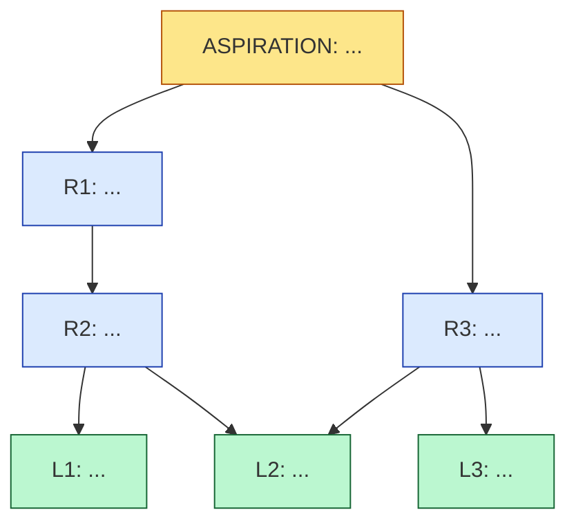

<!--
TEMPLATE.md — the canonical shape for a problem-decomposition document.

Copy this file to <aspiration-slug>.md, fill in every section. Don't rename
the H2 headers — they're how the skill's renderer and any downstream
tooling locate the lattice nodes.

The doc has three layers:
  1. Aspiration (the top — one node)
  2. 5-Whys descent + Requirements (intermediate — many nodes)
  3. Dispatchable leaves (the bottom — many nodes, each a bead spec)

Plus a "Non-leaves queue" for work that's real but not yet dispatchable,
and a Mermaid graph rendering the lattice.
-->

# Problem decomposition — `<aspiration-slug>`

> **Decomposed:** YYYY-MM-DD by `problem-decomposer`
> **Status:** Draft | Reviewed | Locked
> **Refresh after:** YYYY-MM-DD (≤ 3 months from decomposition — aspirations age)

## Aspiration

> One paragraph. The thing-we-want-to-be-true that everything else descends from. Concrete enough that a human can disagree with it; abstract enough that it sits above implementation choices. **An aspiration is a state of the world, not a deliverable.**

Examples of well-shaped aspirations:
- "Ship a platform, not a collection of repos."
- "Every capability is documented, attested, and reproducibly built."
- "An outside team can adopt one of our components in under a day."

Examples of *anti-aspirations* (too low — these belong at the requirement layer):
- "Migrate to Smithy." (this is a means, not an end)
- "Have green CI." (this is a constraint, not an aspiration)
- "Write more tests." (deliverable framing, not state-of-world framing)

## 5-Whys descent

For each branch of the decomposition, walk *up* from a candidate leaf and check that "why?" reaches the aspiration in ≤5 steps. If it takes more than 5, the lattice has a layer that's actually two layers smushed together; split.

Format one chain per major branch. Several chains may share an aspiration — that's the point of a lattice.

### Chain 1 — `<branch-name>`

```
[ASPIRATION] <restate from above>
   ↑ why?
[REQUIREMENT] <one line>
   ↑ why?
[REQUIREMENT] <one line>
   ↑ why?
[REQUIREMENT] <one line>
   ↑ why?
[DISPATCHABLE] <bead title>
```

### Chain 2 — `<branch-name>`

```
[ASPIRATION] <restate>
   ↑ why?
[REQUIREMENT] ...
   ↑ why?
[DISPATCHABLE] <bead title>
```

*(Add more chains as needed; usually 3-7 per aspiration.)*

## Requirement lattice

> Intermediate nodes (the "REQUIREMENT" levels above) listed once each. A requirement may have multiple parent aspirations (in a multi-aspiration doc) or multiple child requirements/leaves (that's the lattice — DAG with partial order).

| ID | Requirement | Parent(s) | Child(ren) |
|----|-------------|-----------|------------|
| R1 | ... | aspiration | R2, R3 |
| R2 | ... | R1 | L1, L2 |
| R3 | ... | R1 | L3, L4 |
| ... | ... | ... | ... |

## Dispatchable leaves

> One section per leaf. Each must pass all 7 dispatchability properties (see `DISPATCHABILITY.md`). The shape below is the **bead spec** — copy directly into `rosary:note` / `rsry_bead_create` / GitHub Issues / Linear / wherever you file work.

### L1 — `<bead title in imperative voice>`

- **Aspiration root:** *(restate the aspiration this leaf serves; if multi-rooted, list all)*
- **Why chain:** L1 → R2 → R1 → Aspiration *(short — full chain lives in §5-Whys descent)*
- **Problem statement:** *(self-contained paragraph — the agent's entire input)*
- **Acceptance criteria:** *(falsifiable — tests, files, command exit codes, doc-at-path)*
- **Inputs:** *(enumerated files, repos, refs, tools, env vars)*
- **Expected output shape:** *(diff against X, new file at Y, passing test Z, etc.)*
- **Scope boundary:** *(what's explicitly NOT this bead; downstream beads named)*
- **Failure mode:** *(how failure becomes visible; e.g. "test exit code", "[stuck] marker in report")*
- **Time-box estimate:** *(S / M / L / decompose-further)*
- **Suggested target repo:** *(where this bead should land)*
- **Suggested priority:** *(P1 / P2 / P3 / P4)*
- **Depends on:** *(other leaves that must complete first, if any)*

### L2 — ...

*(repeat shape)*

## Non-leaves queue

> Work that's real, traces to an aspiration, but isn't yet dispatchable. These are *honest exits* from decomposition — admit they need more work before they're filable. Each entry: what it is, which dispatchability property fails today, what would unblock it.

| Title | Fails property | What would unblock |
|-------|----------------|---------------------|
| "Design substrate-IDL trait library" | #2 (no acceptance criteria), #4 (output shape undefined) | First write an ADR proposing the trait set; then this becomes implementation-shaped |
| "Migrate all 8 repos to art-substrate manifest" | #5 (unbounded scope), #7 (time-box too large) | Decompose into per-repo beads; one leaf per repo |
| ... | ... | ... |

## Lattice (Mermaid)



Note: nodes with multiple incoming edges (e.g. L2 above) are the lattice signal — they serve multiple parents. In a tree, you'd duplicate them. In a lattice, you link both.

## Action items

- [ ] File leaves L1..LN as beads via `rosary:note` (or paste into your tracker)
- [ ] Track non-leaves queue separately (they're not ready to file)
- [ ] Refresh this doc after the first batch of leaves close — the lattice often reveals second-order requirements that weren't visible until first-order leaves shipped

## Cross-references

- Skill that produced this: the `problem-decomposer` skill
- Dispatchability rubric: [`DISPATCHABILITY.md`](DISPATCHABILITY.md)
- Related aspirations / decompositions: *(other docs in this directory)*
- Related ADRs / specs: *(if this decomposition is anchored on existing design docs)*

---

<!-- End of template. Don't rename the H2 headers; downstream tooling
parses them. Add detail with H3s inside existing H2s. -->
