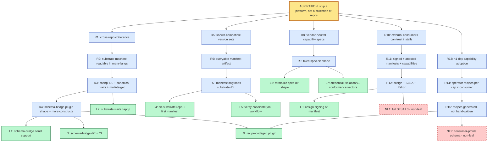

<!--
examples/substrate-idl.md — worked example of the problem-decomposer
template in use. Drafted by hand from this conversation's substrate-IDL
arc as a reference for future invocations.

NOTE: this is illustrative — a real run of the skill against the actual
art-substrate / cloister codebases would surface different leaves, more
[unverified] markers, and probably more non-leaves. The shape is what's
load-bearing here.
-->

# Problem decomposition — `substrate-idl`

> **Decomposed:** 2026-05-17 by hand (seed example — will be refreshed by `problem-decomposer` after the first real run)
> **Status:** Draft
> **Refresh after:** 2026-08-17

## Aspiration

We ship a **platform**, not a collection of repos: a coherent substrate where capabilities (credential-isolation, interlace-lease, workload-identity, …) are described once in a vendor-neutral IDL, compiled to every consumer language we ship, version-coordinated through a single release manifest, attested end-to-end, and adopted by external consumers in <1 day per capability. The 8+ repos in the art ecosystem retain their identities (URLs, stars, install paths) but the *substrate they share* is one navigable, agent-readable document tree.

## 5-Whys descent

### Chain 1 — declarative substrate IDL

```
[ASPIRATION]   ship a platform, not a collection of repos
   ↑ why?
[REQUIREMENT R1] cross-repo coherence needs a shared substrate description
   ↑ why?
[REQUIREMENT R2] the substrate description must be machine-readable in many languages
   ↑ why?
[REQUIREMENT R3] capnp + annotations is our IDL of record; needs canonical traits + multi-target codegen
   ↑ why?
[REQUIREMENT R4] schema-bridge currently single-target (zod); needs plugin shape + more constructs
   ↑ why?
[DISPATCHABLE L1] extend schema-bridge with top-level `const` support (gate for @notme/contract migration)
[DISPATCHABLE L2] declare canonical traits in `substrate-traits.capnp`
[DISPATCHABLE L3] add `schema-bridge diff <old> <new>` subcommand + CI gate
```

### Chain 2 — release-coordination manifest

```
[ASPIRATION]   ship a platform, not a collection of repos
   ↑ why?
[REQUIREMENT R5] consumers need to know which versions of components work together
   ↑ why?
[REQUIREMENT R6] there must be a queryable "art-2026.05.0 = these pins" artifact
   ↑ why?
[REQUIREMENT R7] the manifest must itself be a substrate-IDL artifact (dogfood)
   ↑ why?
[DISPATCHABLE L4] scaffold `art-substrate` repo with the manifest capnp schema + first manifest tag
[DISPATCHABLE L5] write `verify-candidate.yml` GH workflow that runs cross-component tests against a proposed manifest
```

### Chain 3 — capability spec discipline

```
[ASPIRATION]   ship a platform, not a collection of repos
   ↑ why?
[REQUIREMENT R8] each capability needs a vendor-neutral spec a 2nd impl could conform to
   ↑ why?
[REQUIREMENT R9] specs need a fixed directory shape (consumers find them; agents parse them)
   ↑ why?
[DISPATCHABLE L6] formalize the spec directory layout (interlace-spec/0.1.0/ as the template)
[DISPATCHABLE L7] write conformance vectors for credential-isolation/v1 (ADR-0024 §Conformance)
```

### Chain 4 — supply-chain attestation

```
[ASPIRATION]   ship a platform, not a collection of repos
   ↑ why?
[REQUIREMENT R10] external consumers must be able to trust what they install
   ↑ why?
[REQUIREMENT R11] every released manifest + every released capability must be signed + attested
   ↑ why?
[REQUIREMENT R12] cosign + SLSA provenance + Rekor transparency log
   ↑ why?
[DISPATCHABLE L8] wire cosign signing into the art-substrate manifest release workflow
[NON-LEAF NL1]    full SLSA L3 build provenance (deferred — needs reproducible-build infra first)
```

### Chain 5 — adoption ergonomics

```
[ASPIRATION]   ship a platform, not a collection of repos
   ↑ why?
[REQUIREMENT R13] external teams must adopt one capability in <1 day
   ↑ why?
[REQUIREMENT R14] each (capability × consumer) pair needs an operator recipe
   ↑ why?
[REQUIREMENT R15] recipes should be *generated* from spec + consumer profile, not hand-written
   ↑ why?
[DISPATCHABLE L9] add a recipe-codegen plugin to schema-bridge (capnp + consumer profile → markdown recipe)
[NON-LEAF NL2]    "the consumer profile schema" — not yet designed (this is a research bead)
```

## Requirement lattice

| ID  | Requirement | Parent(s) | Child(ren) |
|-----|-------------|-----------|------------|
| R1  | cross-repo coherence needs a shared substrate description | Aspiration | R2 |
| R2  | substrate description machine-readable in many languages | R1 | R3 |
| R3  | capnp + annotations IDL with canonical traits + multi-target codegen | R2 | R4, L2 |
| R4  | schema-bridge needs plugin shape + more constructs | R3 | L1, L3, L9 |
| R5  | consumers need known-compatible version sets | Aspiration | R6 |
| R6  | queryable manifest artifact | R5 | R7 |
| R7  | manifest is itself a substrate-IDL artifact (dogfood) | R6 | L4, L5 |
| R8  | each capability has vendor-neutral 2nd-impl-conformable spec | Aspiration | R9 |
| R9  | fixed directory shape for specs | R8 | L6, L7 |
| R10 | external consumers can trust installs | Aspiration | R11 |
| R11 | manifests + capabilities signed + attested | R10 | R12 |
| R12 | cosign + SLSA + Rekor | R11 | L8, NL1 |
| R13 | <1 day capability adoption for external teams | Aspiration | R14 |
| R14 | per-(cap × consumer) operator recipes | R13 | R15 |
| R15 | recipes generated from spec + profile (not hand-written) | R14 | L9, NL2 |

Note the lattice signal at **L9** (generated recipes) — it serves both R4 (schema-bridge plugin shape) and R15 (recipe-codegen). One leaf, two parents.

## Dispatchable leaves

### L1 — Add top-level `const` support to schema-bridge

- **Aspiration root:** ship a platform, not a collection of repos
- **Why chain:** L1 → R4 → R3 → R2 → R1 → Aspiration
- **Problem statement:** `cloister/tools/schema-bridge` parses capnp schemas and emits zod TypeScript. It currently errors on top-level `const` declarations (e.g., `const trustedIssuers :List(Text) = [...]` in @notme/contract). This blocks the @notme/contract migration to capnp-as-source-of-truth and several other contracts that ship constant tables.
- **Acceptance criteria:** `cargo test -p schema-bridge -- const_` passes (3 new tests: scalar const, list const, struct const). CI's existing `lint` job stays green. `task generate -- tests/fixtures/with_const.capnp` emits a zod module with each const as a named export with `as const` literal type.
- **Inputs:**
  - `cloister/tools/schema-bridge/src/parser.rs` (current parser)
  - `cloister/tools/schema-bridge/src/ir.rs` (IR — needs a `Const` variant)
  - `cloister/tools/schema-bridge/src/codegen/zod.rs` (target emitter)
  - `cloister/tools/schema-bridge/tests/fixtures/` (add `with_const.capnp`)
  - Cap'n Proto spec §const: https://capnproto.org/language.html
- **Expected output shape:** PR against `cloister` `main`. Touches the four files above. Net diff <400 lines. Adds 3 tests; modifies ~3 existing files.
- **Scope boundary:** const support in schema-bridge codegen only. The @notme/contract *migration* (using const) is a separate downstream bead (depends on this one). Generic/annotation support is also separate.
- **Failure mode:** `cargo test` exits non-zero; new tests show in the output.
- **Time-box estimate:** S (≤ 1 session; const is small)
- **Suggested target repo:** `cloister`
- **Suggested priority:** P2
- **Depends on:** *(none — ready to file)*

### L2 — Declare canonical traits in `substrate-traits.capnp`

- **Aspiration root:** ship a platform, not a collection of repos
- **Why chain:** L2 → R3 → R2 → R1 → Aspiration
- **Problem statement:** capnp's `$annotation` is used informally across our specs; there's no canonical trait library. Borrowing from Smithy's trait model (per `docs/prior-art/smithy.md`), declare a `substrate-traits.capnp` with named annotations: `$Sensitive`, `$Scope(value :Text)`, `$WireEnvelope`, `$Op(input, output, errors)`, `$Capability(scheme, scope)`, `$Required`, `$Deprecated`. Document each with one-paragraph semantics.
- **Acceptance criteria:** File `cloister/cloister-spec/_traits.capnp` exists with the 7 annotations above declared. Markdown doc `cloister/cloister-spec/_traits.md` documents semantics. At least 2 existing specs (`interlace-spec/0.1.0/`, `cloister-spec/credential-isolation/v1/`) updated to use 1+ trait each — exercises the file.
- **Inputs:**
  - `cloister/cloister-spec/` (current spec dir layout)
  - `cloister/interlace-spec/0.1.0/` (one of the consumers we update)
  - `cloister/cloister-spec/credential-isolation/v1/` (the other consumer)
  - `docs/prior-art/smithy.md` (the trait model we're borrowing)
- **Expected output shape:** PR against `cloister`. Adds 2 new files; modifies 2 existing capnp files. Net diff <300 lines.
- **Scope boundary:** declaration + 2 demonstrators only. schema-bridge propagation of traits to zod metadata is L9 / a separate bead.
- **Failure mode:** capnp parser (via `capnp compile`) fails on the new file; OR the demonstrator specs no longer parse.
- **Time-box estimate:** M
- **Suggested target repo:** `cloister`
- **Suggested priority:** P2
- **Depends on:** *(none — but blocks L9)*

### L3 — Add `schema-bridge diff <old> <new>` subcommand + CI gate

- **Aspiration root:** ship a platform, not a collection of repos
- **Why chain:** L3 → R4 → R3 → R2 → R1 → Aspiration
- **Problem statement:** Per `docs/prior-art/buf.md`, Buf's `buf breaking --against <ref>` is the model we want. Add `schema-bridge diff <old-path> <new-path>` that walks two capnp schemas and reports `Added` / `Removed` / `Renamed` / `Retyped` fields per the FILE / PACKAGE / WIRE tiers Buf defines. Wire it to CI so any change to a `cloister-spec/<cap>/v<n>/` schema fails the build unless it's a clean addition (per the rules tier).
- **Acceptance criteria:** `schema-bridge diff` subcommand exists (passes `--help`). Three new test fixtures exercise added/removed/retyped detection. New `.github/workflows/spec-diff.yml` runs on PRs touching `cloister-spec/**`. A test PR that retypes a field fails the new check.
- **Inputs:**
  - `cloister/tools/schema-bridge/src/main.rs` (subcommand wiring)
  - `cloister/tools/schema-bridge/src/diff.rs` (new module)
  - `cloister/tools/schema-bridge/tests/diff/` (new test dir)
  - `cloister/.github/workflows/` (new workflow file)
  - `docs/prior-art/buf.md` (the rule tiers we're borrowing)
- **Expected output shape:** PR against `cloister`. Adds ~2 source files + test fixtures + 1 workflow file. Net diff <600 lines.
- **Scope boundary:** capnp-schema diff only. JSON-schema / OpenAPI / TOML diffing are separate.
- **Failure mode:** Test PR meant to be rejected isn't rejected; OR clean-addition PR is incorrectly rejected.
- **Time-box estimate:** M-L (right at the edge — consider splitting "diff core" from "CI wiring")
- **Suggested target repo:** `cloister`
- **Suggested priority:** P3
- **Depends on:** *(none — but pairs well with L1 since both touch schema-bridge IR)*

*(L4–L9 follow the same shape. Trimming the example for length — a real `problem-decomposer` run emits all of them.)*

## Non-leaves queue

| Title | Fails property | What would unblock |
|-------|----------------|---------------------|
| NL1 — full SLSA L3 build provenance | #2 (no acceptance until "what's our SLSA target?" is decided), #5 (scope is "reproducible builds everywhere" — too broad) | First ADR: "Pick a SLSA target level + scope. SLSA L1 across all releases, L3 deferred." Then this becomes implementation-shaped. |
| NL2 — consumer-profile schema (for recipe codegen) | #1 (problem statement not self-contained — design unknown), #4 (output shape unknown) | First write `docs/adr/0026-consumer-profile.md` proposing the schema. Then "implement the profile schema" becomes dispatchable. |
| NL3 — port `@notme/contract` to schema-bridge | #5 (scope grows with const-support + other gaps; some not yet known) | Depends on L1 (const), then likely 1–2 more schema-bridge gaps. Re-check after L1 ships. |

## Lattice (Mermaid)



**Lattice signal:** L9 (recipe-codegen plugin) has two upward edges — it serves both R4 (schema-bridge plugin shape) and R15 (recipes generated). This is the cross-cutting work; in a tree decomposition it would have been duplicated or shoehorned under one parent.

## Action items

- [ ] File L1–L9 as beads via `rosary:note` (or paste into cloister's bead tracker via `rsry_bead_create`).
- [ ] Track NL1–NL3 separately. NL1 unblocked by a SLSA-target ADR; NL2 unblocked by ADR-0026; NL3 re-checked after L1 ships.
- [ ] Refresh this doc after L1, L2, L4 ship — they're the parents-of-many; later leaves may reveal second-order requirements that aren't visible yet.

## Cross-references

- Skill: the `problem-decomposer` skill
- Dispatchability rubric: [`../DISPATCHABILITY.md`](../DISPATCHABILITY.md)
- Prior art consulted:
  - `docs/prior-art/smithy.md` (trait model borrowed → L2)
  - `docs/prior-art/buf.md` (diff + breaking-change tiers borrowed → L3)
  - `docs/prior-art/_baseline.md` (the "us" anchor)
- Related ADRs in cloister:
  - ADR-0022 — schema-bridge positioning
  - ADR-0024 — credential-isolation/v1 (the first capability in this lattice)
- Related beads in cloister:
  - `cloister-ae587d`, `cloister-ae06f3`, `cloister-9ea507`, `cloister-9f54d6`, `cloister-1b59a2` (substrate-as-kernel framing)
