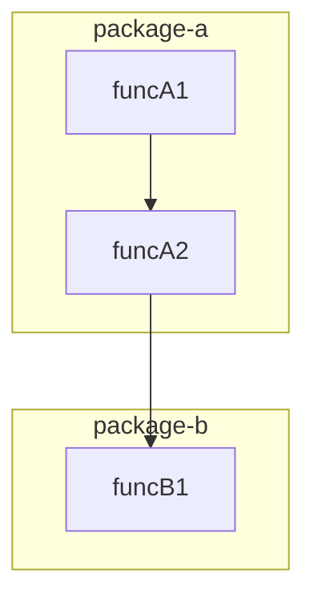

# Survey — Multi-Perspective Codebase Analysis

Run a structured survey of a codebase from multiple agent perspectives. Each perspective examines the same code at a different zoom level, produces findings as beads (tagged with `--actor`), and generates mermaid diagrams from the actual code structure.

## Arguments

$ARGUMENTS

Arguments format: `[repo-path] [--perspectives <list>] [--diagram-only] [--dry-run]`

- **repo-path**: Path to the repo to survey (default: current working directory)
- **--perspectives**: Comma-separated list of perspectives to run (default: all). Options: `prod`, `staging`, `dev`, `feature`, `pm`
- **--diagram-only**: Skip bead creation, only generate mermaid diagrams
- **--dry-run**: Show what would be created without creating beads

If no arguments provided, survey the current working directory from all perspectives.

## The Model

The survey is a **graded filter bank** — each perspective is a bandpass filter examining the same codebase at a different frequency:

| Perspective | Zoom Level | What It Looks For | Actor Tag |
|-------------|-----------|-------------------|-----------|
| **Dev** | High freq — individual functions/files | Dead code, unused imports, TODO debt, complexity hotspots | `dev-agent` |
| **Prod** | Mid-high — module/package patterns | Code smells, anti-patterns, dependency direction violations, error handling gaps | `prod-agent` |
| **Staging** | Mid — test/code correspondence | Fake tests, coverage gaps, test-prod divergence, mocked-but-never-real | `staging-agent` |
| **Feature** | Mid-low — cross-file/cross-package | API surface coherence, circular dependencies, feature flag debt, interface bloat | `feature-agent` |
| **PM** | Low freq — cross-repo patterns | Duplicated functionality across repos, abandoned experiments, scope overlap | `pm-agent` |

The disagreement matrix (where perspectives conflict) is the most valuable output — it reveals concerns that no single perspective would catch alone.

## Prerequisites

- **mache** in PATH (for code structure discovery and graph data)
- **bd** (beads) initialized in the target repo (`bd init`)
- **ley-line** (optional, for deeper AST analysis — falls back to mache if unavailable)
- **tropo** (optional, for topological significance — enhances but not required)

## Workflow

### Phase 1: Discovery — Build the Map

Before any perspective runs, build a structural map of the codebase using mache.

**1.1 Check mache availability**

```bash
which mache 2>/dev/null && echo "FOUND" || echo "NOT_FOUND"
```

If not found, ask the user for the path. If truly unavailable, fall back to manual exploration (Glob + Grep + Read), but warn that diagram generation will be limited.

**1.2 Mount or use MCP**

If mache is available, prefer MCP tools (`mcp__mache__get_overview`, `mcp__mache__list_directory`, etc.) for querying structure. If MCP is not configured, mount via FUSE:

```bash
mache mount --schema auto --writable=false "$REPO_PATH" .mache-mount/survey &
echo $! > .mache-mount/.pid
```

**1.3 Get structural overview**

Using mache MCP or FUSE mount, gather:
- Module/package list
- Entry points (main packages, exported APIs)
- Dependency graph (callers/callees)
- Type hierarchy
- File count and language breakdown

Store this as the **base map** — all perspectives will reference it.

**1.4 Generate the structure diagram**

From mache's graph data, generate a mermaid diagram of the codebase architecture:

```bash
# If mache MCP is available:
# Use get_overview, find_callers, find_callees, get_communities to build the graph
#
# If FUSE mount:
# Read .mache-mount/survey/packages/ or .mache-mount/survey/functions/
# Follow callers/ and callees/ virtual directories
```

Generate mermaid from the discovered structure:



**Key rules for diagram generation:**
- Diagrams are GENERATED from code, never hand-written
- Use mache's `get_communities` to identify natural subgraph boundaries
- Use `find_callers`/`find_callees` for edges
- Collapse internal details — show module-level by default, function-level on request
- Include dependency direction arrows (which package imports which)
- Mark any circular dependencies with red/dashed edges

Write the diagram to `$REPO_PATH/docs/ARCHITECTURE_SURVEY.md` (or update if it exists).

### Phase 2: Perspectives — Run Each Lens

For each selected perspective, examine the codebase through that lens. Use the base map from Phase 1 as the starting point.

**IMPORTANT**: Each perspective runs as a focused analysis pass. Do NOT try to find everything — find the things that THIS perspective uniquely cares about.

#### 2.1 Dev Perspective (`--actor dev-agent`)

Focus: individual functions and files.

- Scan for TODO/FIXME/HACK comments and assess staleness
- Identify functions over 50 lines (complexity hotspots)
- Find unused exports / dead code paths
- Check for hardcoded values that should be config
- Look at error handling: swallowed errors, bare panics, empty catch blocks

Label beads: `--labels "perspective:dev,survey:<timestamp>"`

#### 2.2 Prod Perspective (`--actor prod-agent`)

Focus: module-level quality patterns.

- Check dependency direction: do lower layers import upper layers?
- Identify god packages (too many responsibilities)
- Look for anti-patterns: global mutable state, init() side effects (Go), circular imports
- Assess error propagation: are errors wrapped with context?
- Check for missing input validation at system boundaries

Label beads: `--labels "perspective:prod,survey:<timestamp>"`

#### 2.3 Staging Perspective (`--actor staging-agent`)

Focus: test/code correspondence.

- For each package with tests, assess: do the tests test real behavior or just mock everything?
- Find packages with zero test coverage
- Look for test files that import mocks of the thing they're supposed to test
- Check integration test coverage vs unit test coverage
- Identify flaky test patterns (sleep-based synchronization, time-dependent assertions)

Label beads: `--labels "perspective:staging,survey:<timestamp>"`

#### 2.4 Feature Perspective (`--actor feature-agent`)

Focus: cross-file and cross-package coherence.

- Using mache's graph, identify API surface boundaries
- Check for interface bloat (interfaces with 10+ methods)
- Find circular dependency cycles between packages
- Look for feature flags that are always true/false (dead branches)
- Assess whether related functionality is co-located or scattered

Label beads: `--labels "perspective:feature,survey:<timestamp>"`

#### 2.5 PM Perspective (`--actor pm-agent`)

Focus: strategic/cross-repo patterns.

- If multiple repos are available (check `rosary.toml` or scan parent directory), look for duplicated functionality
- Identify abandoned experiments (directories with no commits in 30+ days)
- Check for README/doc staleness vs actual code state
- Look at commit velocity per package — which areas are active vs neglected?
- Assess: is the repo doing too many things? Should it be split?

Label beads: `--labels "perspective:pm,survey:<timestamp>"`

### Phase 3: Bead Creation

For each finding, create a bead:

```bash
bd create "<finding title>" \
  --description "<what was found, why it matters, where it is>" \
  --actor "<perspective>-agent" \
  --labels "perspective:<perspective>,survey:<YYYY-MM-DD>" \
  --priority <0-4> \
  --type task
```

Priority mapping:
- P0: Security issue, data loss risk, broken functionality
- P1: Architectural violation, significant technical debt
- P2: Code quality issue, missing tests, anti-pattern
- P3: Style issue, minor improvement, documentation gap
- P4: Nitpick, optimization opportunity

### Phase 4: Disagreement Matrix

After all perspectives run, produce the matrix. This is the most important output.

**4.1 Cross-reference findings**

Group findings by code location (file or package). For each location that has findings from 2+ perspectives, note the agreement/disagreement:

```markdown
## Disagreement Matrix

| Location | Dev | Prod | Staging | Feature | PM |
|----------|-----|------|---------|---------|-----|
| pkg/auth | - | "god package" | "tests mock everything" | "API surface too wide" | - |
| pkg/worker | "50+ TODO comments" | - | "zero test coverage" | - | "duplicates pkg/runner" |
| cmd/server | - | "swallowed errors" | - | "circular dep with pkg/config" | - |
```

**4.2 Identify curvature**

Where 2+ perspectives flag the same location but for different reasons, that's a **high-value signal**. These locations have multi-dimensional problems that individual reviews would miss.

Highlight these in the output:

```markdown
### High-Curvature Zones (multiple perspectives disagree)

1. **pkg/auth** — Prod sees a god package, staging sees fake tests, feature sees API bloat.
   This is likely a single root cause: the package grew without boundaries.
   → Suggested action: decompose into sub-packages with clear interfaces.
```

**4.3 Write the matrix**

Append the disagreement matrix to `$REPO_PATH/docs/ARCHITECTURE_SURVEY.md` (same file as the mermaid diagram).

### Phase 5: Summary

Output to the user:
- Total findings per perspective
- Number of high-curvature zones
- Generated diagram location
- Bead IDs created (grouped by perspective)

## Diagram Generation Details

### From mache graph → mermaid

The key insight: mache already has the graph. It parses AST via tree-sitter, builds a call graph, identifies communities. We just need to render it as mermaid.

**Module-level diagram** (default):
- One subgraph per package/module
- Edges = import relationships between packages
- Edge weight = number of cross-package calls
- Communities (from `get_communities`) become subgraph clusters
- Circular dependencies highlighted with `style` annotations

**Function-level diagram** (on request, per-package):
- One node per exported function
- Edges = call relationships (from `find_callers`/`find_callees`)
- Color by complexity or test coverage if available

**Terraform-specific** (if `.tf` files detected):
- Module dependency graph
- Resource → provider mapping
- State file cross-references

### Bidirectional flow

```
Code (source files)
  ↓ ley-line (tree-sitter AST parse)
  ↓ mache (graph projection, community detection)
  ↓ survey skill (multi-perspective analysis)
  ↓
  ├── mermaid diagrams (ARCHITECTURE_SURVEY.md)
  ├── beads (tagged findings per perspective)
  └── disagreement matrix (curvature signal)
  ↓
  agent acts on findings → mache write-back → source files updated
  ↓
  re-survey to verify (delta mode)
```

The diagrams are never hand-maintained. They are regenerated from code on each survey run. If the code changes, the diagram changes. This is the opposite of "draw a diagram then forget to update it."

## Re-survey (Delta Mode)

When re-running on a repo that was previously surveyed:

1. Check for existing beads with `survey:<previous-date>` labels
2. For each previous finding, verify if it's still present
3. Auto-close beads for resolved issues: `bd close <id> --reason "Resolved: no longer detected in survey <date>"`
4. Only create new beads for new findings
5. Update the mermaid diagram
6. Show delta: what improved, what regressed, what's new

## Cleanup

If mache was mounted via FUSE:

```bash
if [ -f .mache-mount/.pid ]; then
  kill "$(cat .mache-mount/.pid)" 2>/dev/null
  rm .mache-mount/.pid
fi
umount .mache-mount/survey 2>/dev/null || diskutil unmount .mache-mount/survey 2>/dev/null
```

## Example Usage

```bash
# Full survey of current repo
/survey

# Only prod and staging perspectives
/survey . --perspectives prod,staging

# Just generate the diagram, no beads
/survey ~/work/monorepo --diagram-only

# Dry run — see what would be found
/survey --dry-run

# Re-survey to check progress
/survey  # will detect previous survey beads and run in delta mode
```

## Relationship to Rosary

This skill is the **manual trigger** for what rosary will eventually automate. When rosary's reconciliation loop runs, it dispatches agents with specific perspectives — that's the automated version of this skill. The survey skill lets you run the same analysis interactively, on demand, for any repo.

The `--actor` tags on beads are the bridge: rosary can query `bd list --labels "perspective:prod"` to see what the prod lens found, regardless of whether a human ran `/survey` or rosary dispatched an automated prod-agent.
